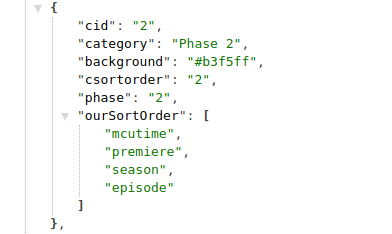
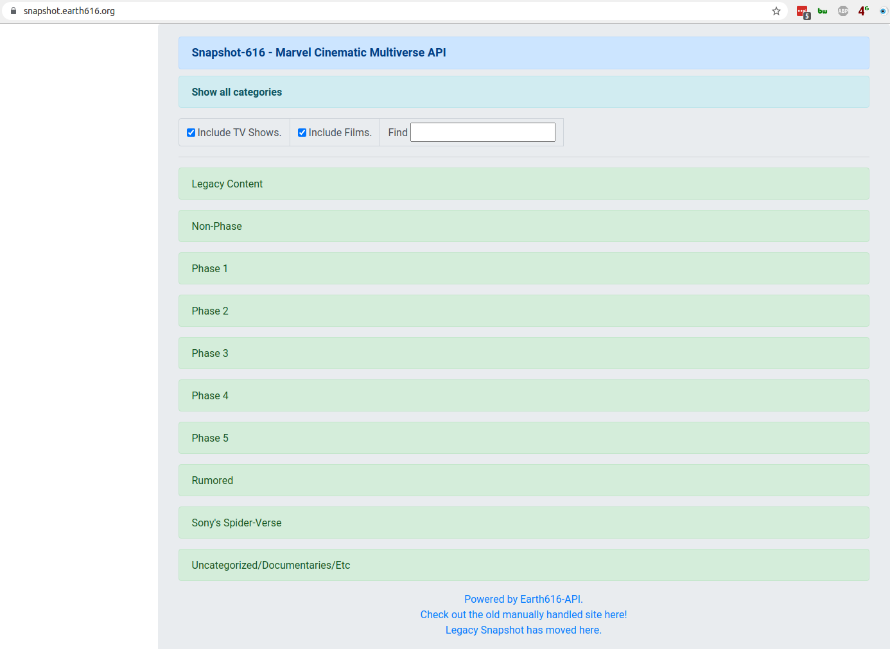
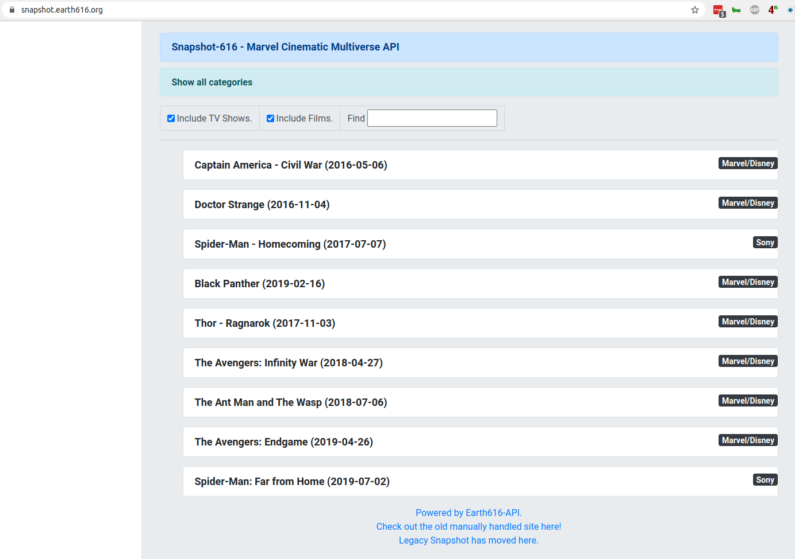

# Marvel MCU Timeline API

## Package content

This project makes use of jquery and bootstrap, rendering data from the MCU API Database. The database itself keeps
track of the timeline order with focus on premiere dates and when events takes place in the MCU in MCU time.

## How it works

This html-ajax-project communicates with an API located
at [Earth616.ORG](https://docs.tornevall.net/display/TORNEVALL/Marvel+MCU+Timeline+API). There are currently several
resources that is currently in development, but this sample site takes advantage of two specific calls, that makes
requests faster:

### First API Call

First API Call is a [GET at categories](https://api.earth616.org/api/mcu/categories). The MCU timeline is split up into
sections depending on what you are interested in, and most of us are probably interested in the categories covering the
different phases of the MCU. As the documentation mentions there are much more information in the category output than
we are caring about:

Some of those values has been of the [prior website](https://mcu.earth616.org/pages/viewpage.action?pageId=54132764)
where each phase was (is) much defined with different colours. In our project this set up is not required as we build it
another way. This project only uses this category setup to improve the performance, since we don't have to get all
titles bulked at the same time. As soon as the HTML page rendered the category, it starts downloading the title list for
each category which leads us to the ...

### ... Second API Call

The second call is based on one of the first API calls built to the api. The timeline. But since this page was built, it
has been improved so that we can show the timeline based on respective category id. For example, Phase 1 has the id 1,
so to request all movie/tv-titles in that phase, we just call for it with
a [simple GET request](https://api.earth616.org/api/mcu/timeline/category/1/). For this category we can not yet split up
the listview from the API based on TV- and movie so the javascript has to work with the variables extracted from the
title list instead.

As you [can see here](https://docs.tornevall.net/x/IYDjB), it's quite easy to extract values and keep titling separated
by the int/boolean column tv. You can also, according to the documentation, furthermore split up TV shows and movies
based on whether they are animated or not.

## What's still in progress

There are several columns that has extra content data from IMDB. There are also other columns in the API that contains
external URL to information, articles and youtube. For the moment, youtube-links are not integrated in this system.
Also, very recently the API was updated with insert- and update timestamps. This means that we can keep track on changes
by comparing the stored datestamps with new. If there is new data updated in the API we can very simple update the
containers with this data.

## Screenshot

### Onepage Html View - Overview Part

### Onepage Html View - Expanded Category for Phase 3

## History

If you want to take a look of a project that works with AJAX processing against the API you can take a look at
https://snapshot.earth616.org/ that is live and running on this codebase.

This is a project that has a long history with a lot of manual handling - the first version was handled in a confluence
documentation (https://mcu.earth616.org/pages/viewpage.action?pageId=54132764) and is still partially maintained.

Time passed and the list of available films and tv-series in the Marvel Cinematic Universe (that some people rather call
Marvel Cinematic Multiverse as of today) has been harder to maintain and still make it look good. Also, the overview in
the current maintained list gets harder and harder to update as there are a lot of content to edit.

And that's how the idea started. When a new API was planned, the entire list was transferred into a database and an Open
API was created (https://mcu.earth616.org/pages/viewpage.action?pageId=82018337). From this API, everything that has to
do with the current film and tv-series is available. The base idea of this system was to keep track of when all events
takes place, since that makes it possible to view everything either in order by the premiere dates, or in order in which
the movies takes place in the MCU.

The plans was initially to make this a react application that handled stuff automatically. But since I (still) hate
react even after trying that way, this solution was created instead; with jquery and bootstrap. Since the API is wide
open, everyone can take inspiration from this project and create their own search engine or whatever comes to mind.

For this specific project, if any ideas comes to your mind, the suggestion is to join and/or contact me so that can be
added either into the API or this project.
